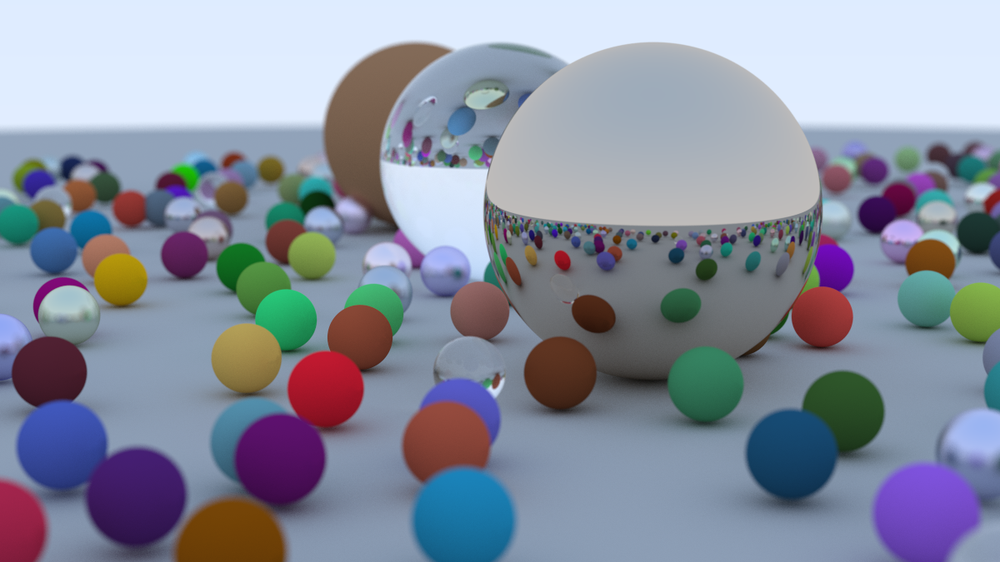

# Taichi Raytracer

Raytracer built with Python and the Taichi Library.


### [_Ray Tracing in One Weekend_](https://raytracing.github.io/books/RayTracingInOneWeekend.html) final render


### Cornell Box

## Why not C++?
While C++ usually runs orders of magnitude times faster than Python, the Taichi library compiles Python code into native CPU or GPU code which allows developers to avoid the many frustrating hours and thousands of lines needed to write efficient C++/CUDA code without sacrificing performance. 

## Installation
```
pip install taichi
```
